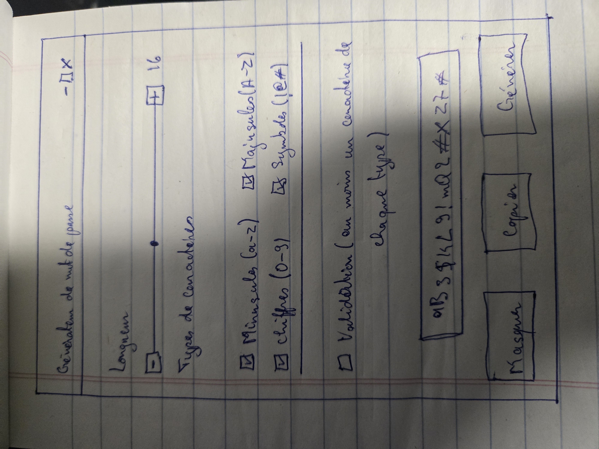
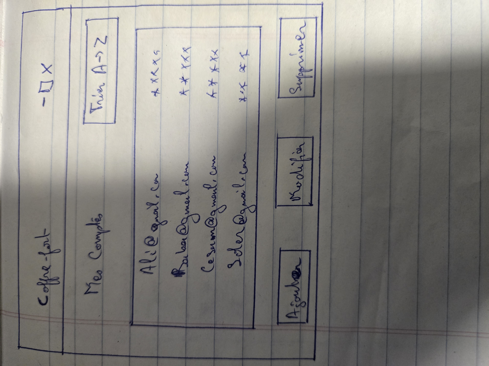

# Destionnaire de mots de passe

## Auteur
-Yao Denis Fiodegbekou 2515601, 

## Description

Application de génération de gestion de mots de passe

```bash
git clone https://github.com/yaodenisfiodegbekou-ops/Tp1_2515601_YaoDenisFiodegbekou.git
cd Tp1_2515601_YaoDenisFiodegbekou
uv sync
```

## Utilisation (partie 1 : ligne de commande)

```bash
uv run main.py
uv run main.py --length 20 --validate
uv run main.py --no-symbols --no-digits
```

| Argument | Description |
|---|---|
| `--length` | Longueur du mot de passe (16 par défaut) |
| `--no-lower` | Exclut les minuscules |
| `--no-upper` | Exclut les majuscules |
| `--no-digits` | Exclut les chiffres |
| `--no-symbols` | Exclut les symboles |
| `--validate` | Exige au moins un caractère de chaque type sélectionné |

## Maquettes

### Fenêtre de génération



### Fenêtre du coffre-fort

